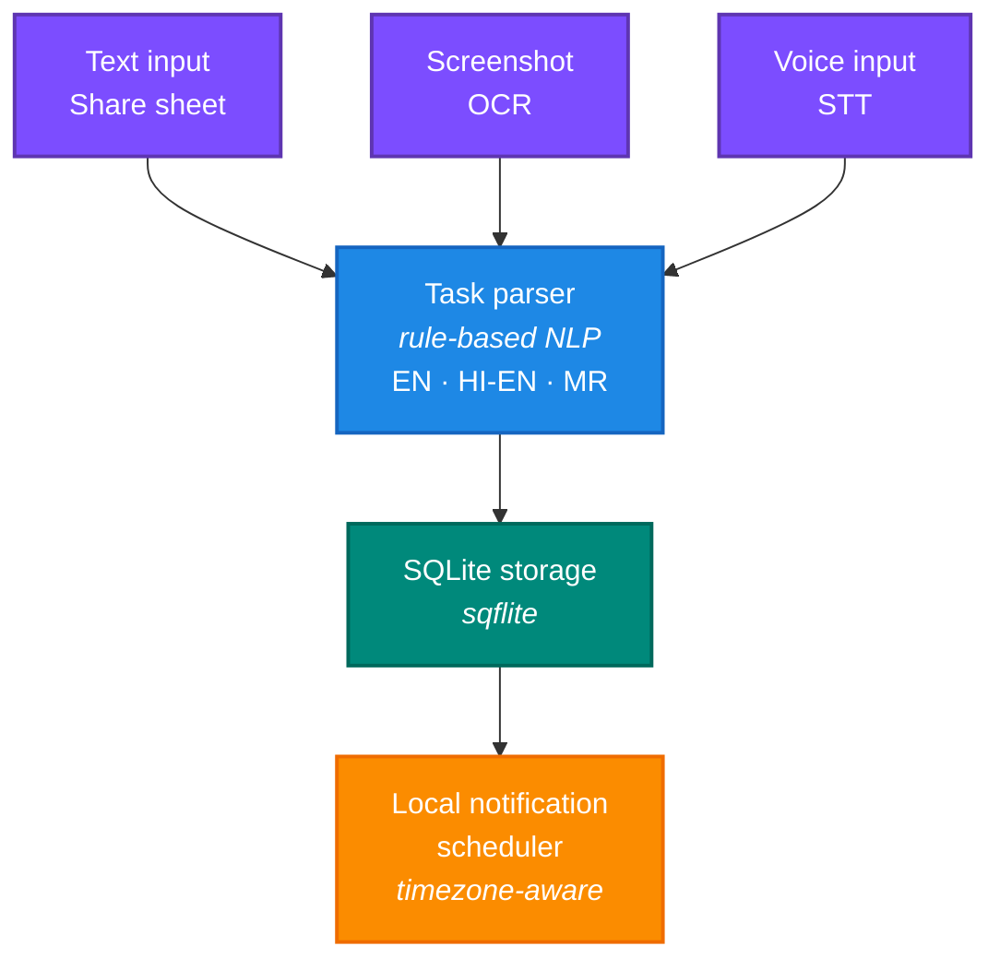
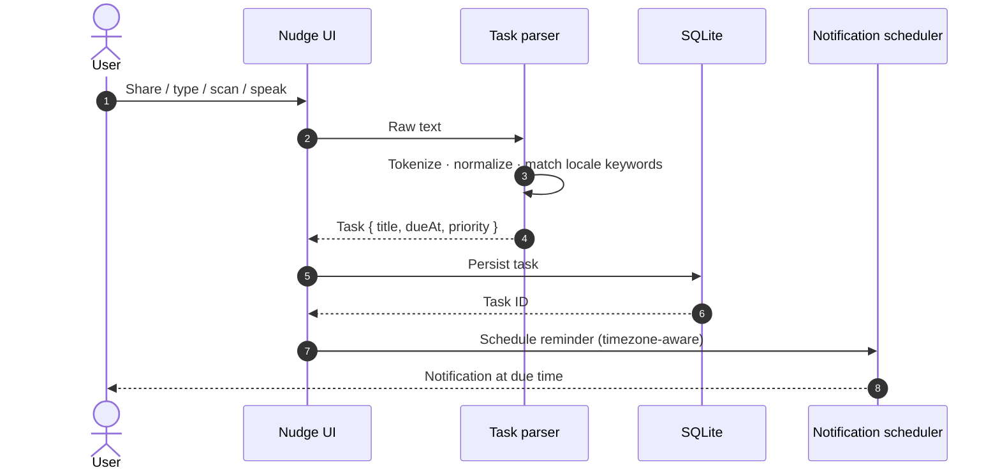

<!-- ============================================================ -->
<!--                          HEADER                              -->
<!-- ============================================================ -->

<div align="center">

<!-- BANNER -->
<!-- Replace with: docs/media/banner.png (recommended size: 1280x400) -->


<br /><br />

<!-- LOGO -->
<!-- Replace with: docs/media/logo.png (recommended size: 160x160) -->


<h1>Nudge</h1>

<p>
  <i>Your deadline brain. Never miss what matters.</i>
</p>

<p>
  An <b>offline-first</b> Flutter app that turns messy text, screenshots, and shared documents
  <br />
  into clean, actionable tasks - automatically, on-device, in your language.
</p>

<br />

<!-- PRIMARY BADGES -->
<p>
  <a href="https://flutter.dev"></a>
  <a href="https://dart.dev"></a>
  
  
</p>

<!-- SECONDARY BADGES -->
<p>
  <a href="LICENSE"></a>
  
  
  
  
  
</p>

<br />

<!-- NAVIGATION -->
<p>
  <a href="#-demo"><b>Demo</b></a>
  &nbsp;·&nbsp;
  <a href="#-features"><b>Features</b></a>
  &nbsp;·&nbsp;
  <a href="#-tech-stack"><b>Tech stack</b></a>
  &nbsp;·&nbsp;
  <a href="#-how-it-works"><b>How it works</b></a>
  &nbsp;·&nbsp;
  <a href="#-screenshots"><b>Screenshots</b></a>
  &nbsp;·&nbsp;
  <a href="#-getting-started"><b>Get started</b></a>
  &nbsp;·&nbsp;
  <a href="#-roadmap"><b>Roadmap</b></a>
</p>

</div>

<br />

> [!NOTE]
> Nudge runs **entirely on-device**. No accounts, no cloud, no telemetry. Your messages, screenshots, and tasks never leave your phone.

<br />

<!-- ============================================================ -->
<!--                            DEMO                              -->
<!-- ============================================================ -->

<h2 align="center">
  
</h2>

<p align="center"><i>A 30-second walkthrough: paste, parse, get reminded.</i></p>

<div align="center">

<!-- Replace with: docs/media/demo.gif -->


<!-- Click-through video alternative
<a href="docs/media/demo.mp4">
  
</a>
-->

</div>

<br />

<!-- ============================================================ -->
<!--                         WHY NUDGE                            -->
<!-- ============================================================ -->

<h2 align="center">
  
</h2>

<table>
<tr>
<td width="55%" valign="top">

<br />

Students live inside group chats, PDFs, and screenshots. Deadlines hide in casual messages -

> *"kal submit karna hai"*
> *"udya report dena ahe"*
> *"reminder, viva on Friday 4pm"*

Most task apps make you stop, switch context, and **type it all in again**.

Nudge reads that noise the way a friend would, and quietly turns it into a task with a reminder. Forward a message. Share a screenshot. Speak a sentence. That's it.

</td>
<td width="45%" valign="top">

<!-- Replace with: docs/media/why-illustration.png -->


</td>
</tr>
</table>

<br />

<!-- ============================================================ -->
<!--                          FEATURES                            -->
<!-- ============================================================ -->

<h2 align="center">
  
</h2>

<table>
  <tr>
    <td align="center" width="33%" valign="top">
      <br />
      
      <h3>Smart parser</h3>
      <p>Understands English, Hinglish, and Marathi (English script). Extracts dates, times, and priorities from natural sentences.</p>
    </td>
    <td align="center" width="33%" valign="top">
      <br />
      
      <h3>Share intent</h3>
      <p>Receive text or files from any app via the Android share sheet - instant, friction-free task creation.</p>
    </td>
    <td align="center" width="33%" valign="top">
      <br />
      
      <h3>OCR import</h3>
      <p>Pull deadlines straight from screenshots, posters, and notice boards using Google ML Kit.</p>
    </td>
  </tr>
  <tr>
    <td align="center" width="33%" valign="top">
      <br />
      
      <h3>Voice input</h3>
      <p>Dictate tasks hands-free with on-device speech-to-text. Perfect for the walk between classes.</p>
    </td>
    <td align="center" width="33%" valign="top">
      <br />
      
      <h3>Calendar view</h3>
      <p>See deadlines laid out by day with priority-aware highlighting and quick reschedule.</p>
    </td>
    <td align="center" width="33%" valign="top">
      <br />
      
      <h3>Local reminders</h3>
      <p>Timezone-aware notifications scheduled on-device. No server, no missed pings.</p>
    </td>
  </tr>
  <tr>
    <td align="center" width="33%" valign="top">
      <br />
      
      <h3>Offline-first</h3>
      <p>SQLite-backed local storage. Works on a flight, in a basement, anywhere.</p>
    </td>
    <td align="center" width="33%" valign="top">
      <br />
      
      <h3>Material 3</h3>
      <p>Modern, expressive UI with full dark-mode support and Google Fonts typography.</p>
    </td>
    <td align="center" width="33%" valign="top">
      <br />
      
      <h3>Privacy by default</h3>
      <p>No account, no analytics, no data leaves the device. Period.</p>
    </td>
  </tr>
</table>

<br />

<!-- ============================================================ -->
<!--                         TECH STACK                           -->
<!-- ============================================================ -->

<h2 align="center">
  
</h2>

<div align="center">

<a href="https://skillicons.dev">
  
</a>

<br /><br />

<table>
  <tr>
    <th align="left">Layer</th>
    <th align="left">Technology</th>
  </tr>
  <tr>
    <td>Framework</td>
    <td><b>Flutter</b> &nbsp; <code>3.x</code> &nbsp;·&nbsp; <b>Dart</b> &nbsp; <code>3.x</code></td>
  </tr>
  <tr>
    <td>Local database</td>
    <td><b>SQLite</b> via <code>sqflite</code></td>
  </tr>
  <tr>
    <td>OCR</td>
    <td><b>Google ML Kit</b> Text Recognition</td>
  </tr>
  <tr>
    <td>Speech-to-text</td>
    <td><code>speech_to_text</code> (on-device)</td>
  </tr>
  <tr>
    <td>NLP parsing</td>
    <td>Custom rule-based parser - EN / Hinglish / Marathi</td>
  </tr>
  <tr>
    <td>Notifications</td>
    <td><code>flutter_local_notifications</code> + <code>timezone</code></td>
  </tr>
  <tr>
    <td>Theming</td>
    <td><b>Material 3</b> + Google Fonts</td>
  </tr>
  <tr>
    <td>Platform</td>
    <td>Android (iOS/macOS/web/windows/linux scaffolding included)</td>
  </tr>
</table>

</div>

<br />

<!-- ============================================================ -->
<!--                       HOW IT WORKS                           -->
<!-- ============================================================ -->

<h2 align="center">
  
</h2>

<p align="center"><i>From a casual message to a scheduled reminder, in three quiet steps.</i></p>



### Pipeline detail



### Examples

<div align="center">

| You write | Nudge schedules |
|---|---|
| `kal submit karna hai` | tomorrow |
| `udya report dena ahe` | tomorrow |
| `submit by next Monday` | next Monday |
| `assignment due 15 May 6pm` | 15 May, 6:00 PM |
| `viva parva sakali 10 baje` | day after tomorrow, 10:00 AM |

</div>

<br />

<!-- ============================================================ -->
<!--                        SCREENSHOTS                           -->
<!-- ============================================================ -->

<h2 align="center">
  
</h2>

<p align="center"><i>Tap any image for the full-size version.</i></p>

<div align="center">

<table>
  <tr>
    <td align="center"><b>Home</b></td>
    <td align="center"><b>Calendar</b></td>
    <td align="center"><b>Add task</b></td>
  </tr>
  <tr>
    <td></td>
    <td></td>
    <td></td>
  </tr>
  <tr>
    <td align="center"><b>OCR scan</b></td>
    <td align="center"><b>Share intent</b></td>
    <td align="center"><b>Profile</b></td>
  </tr>
  <tr>
    <td></td>
    <td></td>
    <td></td>
  </tr>
</table>

</div>

<details>
<summary align="center"><b>More screens</b> &nbsp; - &nbsp; onboarding, voice, dark mode</summary>

<br />

<div align="center">

<table>
  <tr>
    <td align="center"><b>Onboarding</b></td>
    <td align="center"><b>Voice input</b></td>
    <td align="center"><b>Dark mode</b></td>
  </tr>
  <tr>
    <td></td>
    <td></td>
    <td></td>
  </tr>
</table>

</div>

</details>

<br />

<!-- ============================================================ -->
<!--                       GETTING STARTED                        -->
<!-- ============================================================ -->

<h2 align="center">
  
</h2>

### Prerequisites

<table>
  <tr>
    <td></td>
    <td>Flutter SDK 3.2.0 or newer</td>
  </tr>
  <tr>
    <td></td>
    <td>Android Studio with the Android SDK, <b>or</b> a physical Android device with USB debugging</td>
  </tr>
  <tr>
    <td></td>
    <td>Java Development Kit 17 or newer</td>
  </tr>
</table>

### Install and run

```bash
# 1. Clone
git clone https://github.com/sahiljo14/nudge-app.git
cd nudge-app

# 2. Fetch dependencies
flutter pub get

# 3. Sanity-check
flutter analyze
flutter test

# 4. Run on a connected device or emulator
flutter run
```

### Build a release APK

```bash
flutter build apk --release
# Output: build/app/outputs/flutter-apk/app-release.apk
```

<details>
<summary><b>Android permissions Nudge requests</b></summary>

<br />

| Permission | Why |
|---|---|
| Camera / storage | OCR scanning and image picking |
| Microphone | Voice input |
| Notifications | Deadline reminders |
| Exact alarms (Android 12+) | Precise reminder scheduling |

</details>

<br />

<!-- ============================================================ -->
<!--                      PROJECT STRUCTURE                       -->
<!-- ============================================================ -->

<h2 align="center">
  
</h2>

```
lib/
├── main.dart                # App entry point
├── database/                # SQLite schema and DAOs
├── models/                  # Task, reminder, and config models
├── parser/
│   └── task_parser.dart     # Rule-based NLP parser
├── services/
│   ├── notification_service.dart
│   ├── ocr_service.dart
│   ├── share_service.dart
│   ├── tts_service.dart
│   ├── user_prefs.dart
│   └── voice_service.dart
├── screens/
│   ├── splash_screen.dart
│   ├── onboarding_screen.dart
│   ├── home_screen.dart
│   ├── calendar_screen.dart
│   ├── add_task_screen.dart
│   ├── text_import_screen.dart
│   ├── doc_import_screen.dart
│   ├── ocr_scan_screen.dart
│   └── profile_screen.dart
├── features/                # Feature-scoped widgets
├── widgets/                 # Shared UI components
├── theme/                   # Material 3 theme config
└── utils/                   # Date helpers, formatters
```

<br />

<!-- ============================================================ -->
<!--                    SUPPORTED LANGUAGES                       -->
<!-- ============================================================ -->

<h2 align="center">
  
</h2>

<div align="center">

| Locale | Examples Nudge understands |
|---|---|
|  | `tomorrow`, `next Monday`, `in 3 days`, `by 5pm` |
|  | `kal`, `parso`, `agle hafte`, `subah`, `shaam` |
|  | `udya`, `parva`, `pudhcha`, `sakali`, `sandhyakali` |

</div>

> Adding a new locale? See `lib/parser/task_parser.dart` for the keyword maps.

<br />

<!-- ============================================================ -->
<!--                          ROADMAP                             -->
<!-- ============================================================ -->

<h2 align="center">
  
</h2>

<div align="center">

| # | Phase | Status |
|:-:|---|:-:|
| 1 | Core app setup + local database |  |
| 2 | Manual task creation |  |
| 3 | Share intent import |  |
| 4 | Hinglish / Marathi deadline parsing |  |
| 5 | OCR for images and screenshots |  |
| 6 | Local deadline reminders |  |
| 7 | Voice input |  |
| 8 | Optional encrypted cloud sync |  |
| 9 | iOS release |  |
| 10 | Home-screen widgets and quick-tile actions |  |

</div>

<br />

<!-- ============================================================ -->
<!--                        CONTRIBUTING                          -->
<!-- ============================================================ -->

<h2 align="center">
  
</h2>

Contributions, issues, and feature requests are welcome.

```bash
# 1. Fork the repo, then:
git checkout -b feat/my-feature

# 2. Make your changes, then verify
flutter analyze
flutter test

# 3. Push and open a PR
git push origin feat/my-feature
```

For larger changes, please open an issue first to align on the approach.

<br />

<!-- ============================================================ -->
<!--                          LICENSE                             -->
<!-- ============================================================ -->

<h2 align="center">
  
</h2>

<p align="center">
  Released under the <a href="LICENSE"><b>MIT License</b></a>.
</p>

<br />

<!-- ============================================================ -->
<!--                          FOOTER                              -->
<!-- ============================================================ -->

<div align="center">

<br />

<h3><i>"Built by students, for students."</i></h3>

<sub>Crafted with care, caffeine, and the occasional last-minute deadline.</sub>

<br /><br />

<a href="#nudge"></a>

</div>
